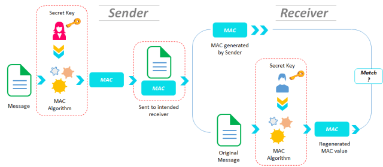

# JavaCryptography🔐
The Java Cryptography Architecture (JCA) is a set of API’s to implement concepts of modern cryptography such as digital signatures, message digests, certificates, encryption, key generation and management, and secure random number generation etc.

## 1: Hash Function#️⃣
Hash function is a mathematical function that converts a numerical input value into another compressed numerical value. The input to the hash function is of arbitrary length but output is always of fixed length.

Values returned by a hash function are called message digest or simply hash values.Java provides a class named MessageDigest which belongs to the package java.security. This class supports algorithms such as SHA-1, SHA 256, MD5 algorithms to convert an arbitrary length message to a message digest.

### To convert a given message to a message digest, follow the steps given below −

#### Step 1: Create a MessageDigest object

```
MessageDigest md = MessageDigest.getInstance("SHA-256");
```

#### Step 2: Pass data to the created MessageDigest object

```
md.update(msg.getBytes());
```

#### Step 3: Generate the message digest

```
byte[] digest = md.digest();
```

### Example code 👩‍💻
```
import sun.security.provider.MD5;

import java.security.MessageDigest;

public class HashFunction {
    //sha256 algorithm
    static void sha256() throws Exception{
        //data to be hashed or converted to message digest
        String msg1="This is message 1";

        //Creating the message digest objec
        MessageDigest md1sha256= MessageDigest.getInstance("SHA-256"); //SHA-256 algorithm

        //Passing data to the created messagedigest object
        md1sha256.update(msg1.getBytes());

        //Compute the message digest
        byte[] digest= md1sha256.digest();
        System.out.println(digest);

        //Converting the byte array in to HexString format
        StringBuffer hexString = new StringBuffer();
        for (int i = 0;i<digest.length;i++) {
            hexString.append(Integer.toHexString(0xFF & digest[i]));
        }
        System.out.println("Hex format : " + hexString.toString());

    };
    //md5 algorithm
    static void md5()throws Exception{
        //data to be hashed or converted to message digest
        String msg1="This is message 1";

        //Creating the message digest objec
        MessageDigest md1md5= MessageDigest.getInstance("MD5"); //md-5 algorithm

        //Passing data to the created messagedigest object
        md1md5.update(msg1.getBytes());

        //Compute the message digest
        byte[] digest= md1md5.digest();
        System.out.println(digest);

        //Converting the byte array in to HexString format
        StringBuffer hexString = new StringBuffer();
        for (int i = 0;i<digest.length;i++) {
            hexString.append(Integer.toHexString(0xFF & digest[i]));
        }
        System.out.println("Hex format : " + hexString.toString());

    }
    //sha1 algorithm
    static void sha1() throws Exception{
        //data to be hashed or converted to message digest
        String msg1="This is message 1";

        //Creating the message digest objec
        MessageDigest md1sha1= MessageDigest.getInstance("SHA-1"); //SHA-1 algorithm

        //Passing data to the created messagedigest object
        md1sha1.update(msg1.getBytes());

        //Compute the message digest
        byte[] digest= md1sha1.digest();
        System.out.println(digest);

        //Converting the byte array in to HexString format
        StringBuffer hexString = new StringBuffer();
        for (int i = 0;i<digest.length;i++) {
            hexString.append(Integer.toHexString(0xFF & digest[i]));
        }
        System.out.println("Hex format : " + hexString.toString());

    };

    public static void main(String  args[])throws Exception{
        sha256();
        md5();
        sha1();


    }
   
}

```

### Output 🖨
```
Sha256
[B@4554617c
Md5
Hex format : 17363d9618bbd089e643f59ff71cff86
[B@74a14482
Sha1
Hex format : c194ec7b8b25a7e41eb8dd3fa9f5e6617aa3976

Process finished with exit code 0

```

## MAC(Message Authentication Code)📧
Message Authentication code uses symetric key technique to provide message authentication.
The sender and receiver share the a symetric key (k) .Essentially, a MAC is an encrypted checksum generated on the underlying message that is sent along with a message to ensure message authentication.

#### Illustration of MAC

[Image source](https://cryptopurview.com/exchanging-sensitive-information-using-message-authentication-code/)

In Java the Mac class of the javax.crypto package provides the functionality of message authentication code. 
#### Follow the steps given below to create message authentication code using this class.

### Step 1: Creating a key generator object

```java
//Creating a Key Generator object
KeyGenerator keygen= KeyGenerator.getInstance("DES");
        
```
The KeyGenerator class provides getInstance() method which accepts a String variable representing the required key-generating algorithm and returns a KeyGenerator object that generates secret keys.

The Data Encryption Standard (DES /ˌdiːˌiːˈɛs, dɛz/) is a symmetric-key algorithm for the encryption of digital data. Although its short key length of 56 bits makes it too insecure for applications, it has been highly influential in the advancement of cryptography.

### Step 2: Create Secure Random Object

```java
//Creating SecureRandom Object
SecureRandom SecRandom=new SecureRandom();
```
The SecureRandom class of the java.Security package provides a strong random number generator which is used to generate random numbers in Java.

### Step 3: Initialize the key generator
```java
//Initializing the KeyGenerator
keygen.init(SecRandom);
```
The KeyGenerator class provides a method named init() this method accepts the SecureRandom object and initializes the current KeyGenerator.

### Step 4: Generate Key
```java
//Generating Key
Key key= keygen.generateKey();

```
### Step 5: Creating and Initializw MAC object
```java
 //Creating and Initializing mac object
Mac mac=Mac.getInstance("Hmacsha256");
mac.init(key);
```
The init() method of the Mac class accepts an Key object and initializes the current Mac object using the given key.
### Step 6: Generate Key
```java
//Calculating the MAC
String msg=new String("This is a test message");
byte [] bytes=msg.getBytes();
byte[] macResult=mac.doFinal(bytes);
System.out.println("Mac result:"+new String(macResult));

```
The doFinal() method of the Mac class is used to finish the Mac operation

### Example Code👩‍💻
```java
import javax.crypto.KeyGenerator;
import javax.crypto.Mac;
import java.security.Key;
import java.security.SecureRandom;

public class MAC {
    public static void main(String[] args) throws Exception{
        //Creating a KeyGenerator object
        KeyGenerator keygen= KeyGenerator.getInstance("DES");

        //Creating SecureRandom Object
        SecureRandom SecRandom=new SecureRandom();

        //Initializing the KeyGenerator
        keygen.init(SecRandom);

        //Generating Key
        Key key= keygen.generateKey();

        //Creating and Initializing mac object
        Mac mac=Mac.getInstance("Hmacsha256");
        mac.init(key);

        //Calculating the MAC
        String msg=new String("This is a test message");
        byte [] bytes=msg.getBytes();
        byte[] macResult=mac.doFinal(bytes);
        System.out.println("Mac result:"+new String(macResult));


    }
}
```
### Output🖨
```java
"C:\Program Files\Java\jdk1.8.0_202\bin\java.exe" "-javaagent:C:\Program Files\JetBrains\IntelliJ IDEA 2020.3.2\lib\idea_rt.jar=58851:C:\Program Files\JetBrains\IntelliJ IDEA 2020.3.2\bin" -Dfile.encoding=UTF-8 -classpath "C:\Program Files\Java\jdk1.8.0_202\jre\lib\charsets.jar;C:\Program Files\Java\jdk1.8.0_202\jre\lib\deploy.jar;C:\Program Files\Java\jdk1.8.0_202\jre\lib\ext\access-bridge-64.jar;C:\Program Files\Java\jdk1.8.0_202\jre\lib\ext\cldrdata.jar;C:\Program Files\Java\jdk1.8.0_202\jre\lib\ext\dnsns.jar;C:\Program Files\Java\jdk1.8.0_202\jre\lib\ext\jaccess.jar;C:\Program Files\Java\jdk1.8.0_202\jre\lib\ext\jfxrt.jar;C:\Program Files\Java\jdk1.8.0_202\jre\lib\ext\localedata.jar;C:\Program Files\Java\jdk1.8.0_202\jre\lib\ext\nashorn.jar;C:\Program Files\Java\jdk1.8.0_202\jre\lib\ext\sunec.jar;C:\Program Files\Java\jdk1.8.0_202\jre\lib\ext\sunjce_provider.jar;C:\Program Files\Java\jdk1.8.0_202\jre\lib\ext\sunmscapi.jar;C:\Program Files\Java\jdk1.8.0_202\jre\lib\ext\sunpkcs11.jar;C:\Program Files\Java\jdk1.8.0_202\jre\lib\ext\zipfs.jar;C:\Program Files\Java\jdk1.8.0_202\jre\lib\javaws.jar;C:\Program Files\Java\jdk1.8.0_202\jre\lib\jce.jar;C:\Program Files\Java\jdk1.8.0_202\jre\lib\jfr.jar;C:\Program Files\Java\jdk1.8.0_202\jre\lib\jfxswt.jar;C:\Program Files\Java\jdk1.8.0_202\jre\lib\jsse.jar;C:\Program Files\Java\jdk1.8.0_202\jre\lib\management-agent.jar;C:\Program Files\Java\jdk1.8.0_202\jre\lib\plugin.jar;C:\Program Files\Java\jdk1.8.0_202\jre\lib\resources.jar;C:\Program Files\Java\jdk1.8.0_202\jre\lib\rt.jar;D:\JavaCryptography\out\production\JavaCryptography" MAC
Mac result:<!NGI�r~���4|�5�ʥ�$�M4�t�vP

Process finished with exit code 0

```


